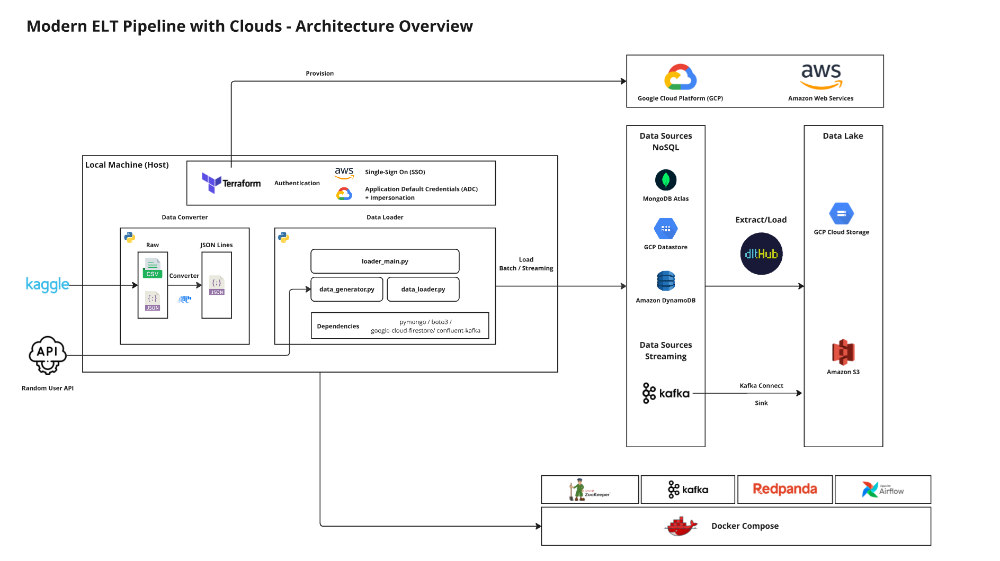
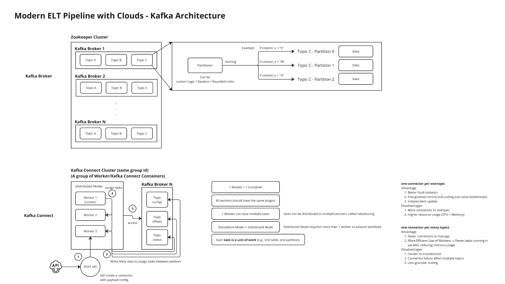

# Modern Data Pipeline with Clouds

*Patcharanat P.*

*Project is paused, and not likely to progress*

## Overview

This project emphasized setting up environment for Data Engineering pipelines, including:
1. Initializing Airflow and Kafka on local environment with docker compose.
2. Enabling cloud resources in GCP and AWS for testing.
3. Implementing Data Loading Module for data initialization.

What expected from this project is technical detail on how to send data for batch and streaming type with different APIs.

**If you're non-technical person or just want concepts of the project, please check [non_technical_guide.md](./docs/non_technical_guide.md) instead of this documnetation.**



## Table of Contents

1. [Pre-requisites](#1-prerequisites)
2. [Setting up Environment](#2-setting-up-environment)
    - 2.1 [Initiating Docker Containers](#21-initiating-docker-containers)
    - 2.2 [Cloud Authentication](#22-cloud-authentication)
    - 2.3 [Initiating Cloud Resources](#23-initiating-cloud-resources)
    - 2.4 [Initiating Data](#24-initiating-data)
3. [Data Pipelines](#3-data-pipelines)
    - 3.1 [Batch](#31-batch)
        - 3.1.1 [Data Load Tool (dlt/dlthub)](#311-data-load-tool-dltdlthub)
        - 3.1.2 [Pyspark Ingestion Framework](#312-pyspark-ingestion-framework)
    - 3.2 [Streaming](#32-streaming)

## 1. Pre-requisites

- Program Installed
    - Python
    - Docker
    - Terraform
    - gcloud CLI
    - aws CLI
- Sensitive Information pre-created
    ```bash
    # .env
    # TODO: Get MongoDB Connection URI From Web UI
    MONGO_URI="mongodb+srv://....mongodb.net"
    GCP__PROJECT="your-project-name"
    ```
    ```bash
    # ./.docker/.env
    # TODO: Set AWS Profile
    AIRFLOW_PROJ_DIR="../.airflow"
    AIRFLOW_UID="50000"
    AWS_PROFILE="<aws-sso-profile>"
    ```
    ```bash
    # .terraform/aws/terraform.tfvars
    profile = "<profile-name>"
    ```
    ```bash
    # .terraform/gcp/terraform.tfvars
    service_account_email = "<service-account-name>@<gcp-project-name>.iam.gserviceaccount.com"
    project_id            = "<gcp-project-name>"
    location              = "<region>"
    ```

## 2. Setting up Environment

### 2.1 Initiating Docker Containers

```bash
make start

# make stop
```

Explanation

- I modified docker compose template by conduktor to use Kafka with redpanda console (conduktor removed)
- At First, if we use original template from Airflow and redpanda (or conduktor), we will not be able to open redpanda console, due to duplicated port exposed, so changing port for redpanda is an only option.
    - Console
        - airflow WebUI: http://localhost:8080
        - kafka (redpanda) console: http://localhost:8085
- Redpanda implicitly use port 8080 to expose, can be changed by setting a specific environment variable, but it's unnecessary, because we can change port to be exposed at higher level in docker-compose.

*Disclaimer*

- Using Docker Compose is not appropriate for production environment.

References

- Airflow Docker Compose Template
    - [Official Airflow Docker Compose Template - Apache Airflow](https://airflow.apache.org/docs/apache-airflow/2.10.5/docker-compose.yaml)
- Kafka Docker Compose Template
    - [Conduktor Kafka Docker Compose Template (Full Stack) - GitHub](https://github.com/conduktor/kafka-stack-docker-compose/blob/master/full-stack.yml)
    - [Redpanda Console Docker Compose Template - GitHub](https://github.com/redpanda-data/console/blob/master/docs/local/docker-compose.yaml)

### 2.2 Cloud Authentication

```bash
# AWS
aws configure sso
# SSO session name: <session-name>
# SSO start URL: <retrieved from AWS Identity Center>
# SSO region: <your-sso-region>
# SSO registration scopes: <leave-blank>

aws configure list-profiles

aws sso login --profile <profile-name>
# Login via WebUI

# GCP
gcloud auth application-default login --impersonate-service-account <service-account-name>@<gcp-project-name>.iam.gserviceaccount.com
```

Explanation

- For me, AWS SSO method is like ADC method in GCP by using account A to act as another account B to grant permissions and be able to interact with cloud resources with permissions of account B.
- Both AWS SSO and GCP ADC are only recommended for local development and make long-lived credentials lesser to be concerned by utilizing global credentials in a local machine with short-lived credentials concept.

References

- Amazon Authentication
    - [Configuration and credential file settings in the AWS CLI](https://docs.aws.amazon.com/cli/latest/userguide/cli-configure-files.html)
- GCP Authentication Detail from Another Project
    - [GCP ADC for Terraform - Ecommerce-Invoice-End-to-end - GitHub](https://github.com/patcha-ranat/Ecommerce-Invoice-End-to-end?tab=readme-ov-file#222-gcp-adc-for-terraform)

### 2.3 Initiating Cloud Resources

```bash
# GCP
# .terrraform/gcp

# AWS
# .terrraform/aws

terraform init
# terraform validate
# terraform fmt
terraform plan
terraform apply
terraform destroy
```

References

- Terraform AWS
    - [AWS Provider (Authentication related) for SSO, please refer to shared credentials - Terraform](https://registry.terraform.io/providers/hashicorp/aws/latest/docs)
    - [Terraform DynamoDB resource - Terraform ](https://registry.terraform.io/providers/hashicorp/aws/latest/docs/resources/dynamodb_table)
    - [Using Terraform with AWS SSO accounts - AWS](https://repost.aws/questions/QUgd8bMJKIRRqgSof0ksVKbA/using-terraform-with-aws-sso-accounts)
    - [IAM vs IAM Identity Center - Reddit](https://www.reddit.com/r/aws/comments/14j4wmn/iam_or_iam_identity_center/)

### 2.4 Initiating Data

In this project, we will download raw data from Kaggle with a custom script: [kaggle_wrapper.sh](./tools/data_init/scripts/kaggle_wrapper.sh). Then, we will convert it from csv to json lines with python script: [converter_main.py](./tools/data_init/converter_main.py). Then, we will use this converted data to load to multiple sources to mock up data sources for ELT process, such as MongoDB, Firestore, DynamoDB for NoSQL Database, and Kafka for streaming.

```bash
make venv

source pyenv/Scripts/activate

make install

./tools/data_init/scripts/kaggle_wrapper.sh

python tools/data_init/converter_main.py
```

Then please refer to [input_example.sh](./tools/data_init/scripts/input_example.sh) for initiating loading data to different targets.

References

- Firestore Python API
    - [Add and update data - GCP](https://cloud.google.com/firestore/docs/manage-data/add-data#pythonasync_6)
    - [Delete documents and fields - GCP](https://cloud.google.com/firestore/docs/manage-data/delete-data)
- DynamoDB Python API
    - [Programming Amazon DynamoDB with Python and Boto3 - AWS](https://docs.aws.amazon.com/amazondynamodb/latest/developerguide/programming-with-python.html)
    - [boto3 Documentation Amazon - DynamoDB - AWS](https://boto3.amazonaws.com/v1/documentation/api/latest/guide/dynamodb.html)
    - [Using boto3 Session to select profile - Stack Overflow](https://stackoverflow.com/questions/33378422/how-to-choose-an-aws-profile-when-using-boto3-to-connect-to-cloudfront)
    - [Avoid unexpected behavior while inserting to dynamodb table by always explicitly define Item parameter - Stack Overflow](https://stackoverflow.com/questions/63615560/boto3-dynamodb-put-item-error-only-accepts-keyword-arguments)
- Kafka Confluent (Python API Client)
    - [confluent-kafka-python - GitHub](https://github.com/confluentinc/confluent-kafka-python/tree/master)
    - [Example of JSON producer - GitHub](https://github.com/confluentinc/confluent-kafka-python/blob/master/examples/json_producer.py)
    - [confluent-kafka api docs - docs.io](https://docs.confluent.io/platform/current/clients/confluent-kafka-python/html/index.html)
- [Python Logging Setting up](https://stackoverflow.com/a/11582124)
- [Python Logging Formatters](https://docs.python.org/3/howto/logging.html#formatters)

## 3. Data Pipelines

## 3.1 Batch - Data Load Tool (dlt/dlthub)

*dlt* is a modern tool for ELT/ETL data pipeline. It can either extract from data sources and load to various target destinations as a json lines file, or as structured format with schema pre-defined.

*Please review [concept.md](./docs/concept.md) for more detail*

References

- dlt
    - [Example of using dlt with Airflow - dlthub](https://dlthub.com/docs/walkthroughs/deploy-a-pipeline/deploy-with-airflow-composer)
    - [How to use dlt with MongoDB - dlthub](https://dlthub.com/docs/dlt-ecosystem/verified-sources/mongodb)
    - [How to supply credentials to dlt pipeline - dlthub](https://dlthub.com/docs/general-usage/credentials/setup#examples)
    - [Advanced detail of managing credentials in dlt & Example of setting credentials in dlt-Airflow](https://dlthub.com/docs/general-usage/credentials/advanced#write-configs-and-secrets-in-code)
    - [dlt with Cloud storage and filesystem Configuration - dlthub](https://dlthub.com/docs/general-usage/credentials/advanced#write-configs-and-secrets-in-code)
- Airflow
    - [Airflow BaseHook get_connection - Apache Airflow](https://airflow.apache.org/docs/apache-airflow/2.1.2/_api/airflow/hooks/base/index.html#airflow.hooks.base.BaseHook.get_connection)
    - [Managing Airflow Connections with BaseHook - Stack Overflow](https://stackoverflow.com/a/45305477)

## 3.2 Streaming



References

- [How to set connector config & kafka related service - Medium](https://poonsht.medium.com/https-poonsht-medium-com-kafka-connect-cdc-mongodb-elasticsearch-demo-part-19e64a01a5b9)
- [Kafka Amazon S3 Sink Connector](https://www.confluent.io/hub/confluentinc/kafka-connect-s3)
    - [Amazon S3 Sink Connector Documentation - Confluent](https://docs.confluent.io/kafka-connectors/s3-sink/current/overview.html)
    - [Amazon S3 Sink Connector Configiuration Reference - Confluent](https://docs.confluent.io/kafka-connectors/s3-sink/current/configuration_options.html#s3)
    - [How to authenticate with AWS with Environment Variable - AWS](https://docs.aws.amazon.com/sdk-for-java/v1/developer-guide/credentials.html)
- [How to deploy kafka connector with config file - Stackoverflow](https://stackoverflow.com/a/47101871)
- [Unknow Magic byte! Trobleshooting: related to Using Different Serializer - GitHub](https://github.com/confluentinc/kafka-connect-elasticsearch/issues/424)


*Please review [concept.md](./docs/concept.md) for more detail*
