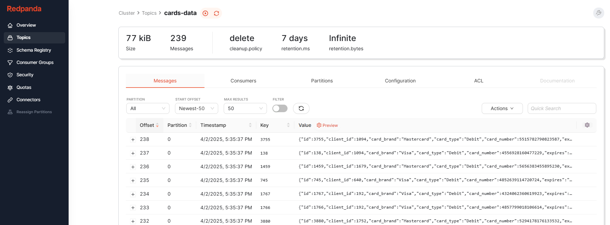
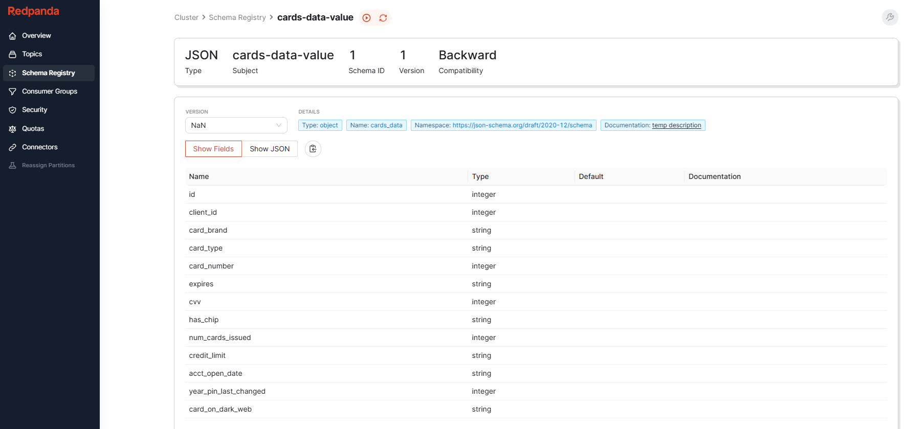
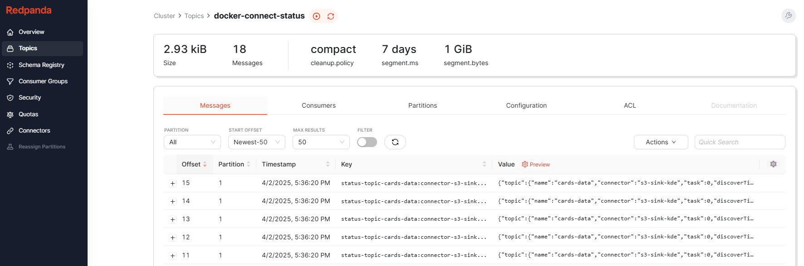
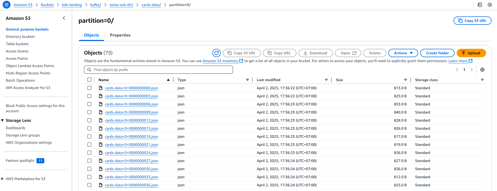

# Modern Data Pipeline with Clouds

*Patcharanat P.*


## Overview

This project emphasized setting up environment for Data Engineering pipelines, including:
1. Initializing Airflow and Kafka on local environment with docker compose.
2. Enabling cloud resources in GCP and AWS for testing.
3. Implementing Data Loading Module for data initialization.

What expected from this project is technical detail on how to send data for batch and streaming type with different APIs.

**If you're non-technical person or just want concepts of the project, please check [concept.md](./docs/concept.md) instead of this main documnetation.**


## Table of Contents

1. [Pre-requisites](#1-prerequisites)
2. [Setting up Environment](#2-setting-up-environment)
    - 2.1 [Initiating Docker Containers](#21-initiating-docker-containers)
    - 2.2 [Cloud Authentication](#22-cloud-authentication)
    - 2.3 [Initiating Cloud Resources](#23-initiating-cloud-resources)
    - 2.4 [Initiating Data](#24-initiating-data)
3. [Data Pipelines](#3-data-pipelines)
    - 3.1 [3.1 Batch - Data Load Tool (dlt/dlthub)](#31-batch---data-load-tool-dltdlthub)
    - 3.2 [Streaming - Kafka](#32-streaming---kafka)

## 1. Pre-requisites

- Program Installed
    - Python
    - Docker
    - Terraform
    - gcloud CLI
    - aws CLI
- Sensitive Information pre-created
    ```bash
    # .env
    # TODO: Get MongoDB Connection URI From Web UI
    MONGO_URI="mongodb+srv://....mongodb.net"
    GCP__PROJECT="your-project-name"
    ```
    ```bash
    # ./.docker/.env
    # TODO: Set AWS Profile
    AIRFLOW_PROJ_DIR="../.airflow"
    AIRFLOW_UID="50000"

    AWS_PROFILE="<aws-sso-profile>"
    AWS_ACCESS_KEY_ID="<your AWS Access Key ID with S3 Permission>"
    AWS_SECRET_ACCESS_KEY="<your AWS Secret Key with S3 Permission>"
    ```
    ```bash
    # .terraform/aws/terraform.tfvars
    profile = "<profile-name>"
    ```
    ```bash
    # .terraform/gcp/terraform.tfvars
    service_account_email = "<service-account-name>@<gcp-project-name>.iam.gserviceaccount.com"
    project_id            = "<gcp-project-name>"
    location              = "<region>"
    ```

## 2. Setting up Environment

### 2.1 Initiating Docker Containers

```bash
make start

# make stop
```

Explanation

- I modified docker compose template by conduktor to use Kafka with redpanda console (conduktor removed)
- At First, if we use original template from Airflow and redpanda (or conduktor), we will not be able to open redpanda console, due to duplicated port exposed, so changing port for redpanda is an only option.
    - Console
        - airflow WebUI: http://localhost:8080
        - kafka (redpanda) console: http://localhost:8085
- Redpanda implicitly use port 8080 to expose, can be changed by setting a specific environment variable, but it's unnecessary, because we can change port to be exposed at higher level in docker-compose.

*Disclaimer*

- Using Docker Compose is not appropriate for production environment.

References

- Airflow Docker Compose Template
    - [Official Airflow Docker Compose Template - Apache Airflow](https://airflow.apache.org/docs/apache-airflow/2.10.5/docker-compose.yaml)
- Kafka Docker Compose Template
    - [Conduktor Kafka Docker Compose Template (Full Stack) - GitHub](https://github.com/conduktor/kafka-stack-docker-compose/blob/master/full-stack.yml)
    - [Redpanda Console Docker Compose Template - GitHub](https://github.com/redpanda-data/console/blob/master/docs/local/docker-compose.yaml)

### 2.2 Cloud Authentication

```bash
# AWS
aws configure sso
# SSO session name: <session-name>
# SSO start URL: <retrieved from AWS Identity Center>
# SSO region: <your-sso-region>
# SSO registration scopes: <leave-blank>

aws configure list-profiles

aws sso login --profile <profile-name>
# Login via WebUI

# GCP
gcloud auth application-default login --impersonate-service-account <service-account-name>@<gcp-project-name>.iam.gserviceaccount.com
```

Explanation

- For me, AWS SSO method is like ADC method in GCP by using account A to act as another account B to grant permissions and be able to interact with cloud resources with permissions of account B.
- Both AWS SSO and GCP ADC are only recommended for local development and make long-lived credentials lesser to be concerned by utilizing global credentials in a local machine with short-lived credentials concept.

References

- Amazon Authentication
    - [Configuration and credential file settings in the AWS CLI](https://docs.aws.amazon.com/cli/latest/userguide/cli-configure-files.html)
- GCP Authentication Detail from Another Project
    - [GCP ADC for Terraform - Ecommerce-Invoice-End-to-end - GitHub](https://github.com/patcha-ranat/Ecommerce-Invoice-End-to-end?tab=readme-ov-file#222-gcp-adc-for-terraform)

### 2.3 Initiating Cloud Resources

```bash
# GCP
# .terrraform/gcp

# AWS
# .terrraform/aws

terraform init
# terraform validate
# terraform fmt
terraform plan
terraform apply
terraform destroy
```

References

- Terraform AWS
    - [AWS Provider (Authentication related) for SSO, please refer to shared credentials - Terraform](https://registry.terraform.io/providers/hashicorp/aws/latest/docs)
    - [Terraform DynamoDB resource - Terraform ](https://registry.terraform.io/providers/hashicorp/aws/latest/docs/resources/dynamodb_table)
    - [Using Terraform with AWS SSO accounts - AWS](https://repost.aws/questions/QUgd8bMJKIRRqgSof0ksVKbA/using-terraform-with-aws-sso-accounts)
    - [IAM vs IAM Identity Center - Reddit](https://www.reddit.com/r/aws/comments/14j4wmn/iam_or_iam_identity_center/)

### 2.4 Initiating Data

In this project, we will download raw data from Kaggle with a custom script: [kaggle_wrapper.sh](./tools/data_init/scripts/kaggle_wrapper.sh). Then, we will convert it from csv to json lines with python script: [converter_main.py](./tools/data_init/converter_main.py). Then, we will use this converted data to load to multiple sources to mock up data sources for ELT process, such as MongoDB, Firestore, DynamoDB for NoSQL Database, and Kafka for streaming.

```bash
make venv

source pyenv/Scripts/activate

make install

./tools/data_init/scripts/kaggle_wrapper.sh

python tools/data_init/converter_main.py
```

Then please refer to [input_example.sh](./tools/data_init/scripts/input_example.sh) for initiating loading data to different targets.

References

- Firestore Python API
    - [Add and update data - GCP](https://cloud.google.com/firestore/docs/manage-data/add-data#pythonasync_6)
    - [Delete documents and fields - GCP](https://cloud.google.com/firestore/docs/manage-data/delete-data)
- DynamoDB Python API
    - [Programming Amazon DynamoDB with Python and Boto3 - AWS](https://docs.aws.amazon.com/amazondynamodb/latest/developerguide/programming-with-python.html)
    - [boto3 Documentation Amazon - DynamoDB - AWS](https://boto3.amazonaws.com/v1/documentation/api/latest/guide/dynamodb.html)
    - [Using boto3 Session to select profile - Stack Overflow](https://stackoverflow.com/questions/33378422/how-to-choose-an-aws-profile-when-using-boto3-to-connect-to-cloudfront)
    - [Avoid unexpected behavior while inserting to dynamodb table by always explicitly define Item parameter - Stack Overflow](https://stackoverflow.com/questions/63615560/boto3-dynamodb-put-item-error-only-accepts-keyword-arguments)
- Kafka Confluent (Python API Client)
    - [confluent-kafka-python - GitHub](https://github.com/confluentinc/confluent-kafka-python/tree/master)
    - [Example of JSON producer - GitHub](https://github.com/confluentinc/confluent-kafka-python/blob/master/examples/json_producer.py)
    - [confluent-kafka api docs - docs.io](https://docs.confluent.io/platform/current/clients/confluent-kafka-python/html/index.html)
- [Python Logging Setting up](https://stackoverflow.com/a/11582124)
- [Python Logging Formatters](https://docs.python.org/3/howto/logging.html#formatters)

## 3. Data Pipelines

## 3.1 Batch - Data Load Tool (dlt/dlthub)

*dlt* is a modern tool for ELT/ETL data pipeline. It can either extract from data sources and load to various target destinations as a json lines file, or as structured format with schema pre-defined.

*Please review [concept.md - Detail on Batch Pipeline - dlthub](./docs/concept.md#4-detail-on-batch-pipeline-dlthub) for more detail.*

Related file is [finance_mongo_s3.py](./.airflow/dags/ingest/mongodb/finance_mongo_s3.py) integrating dlt library with Airflow DAG.

References

- dlt
    - [Example of using dlt with Airflow - dlthub](https://dlthub.com/docs/walkthroughs/deploy-a-pipeline/deploy-with-airflow-composer)
    - [How to use dlt with MongoDB - dlthub](https://dlthub.com/docs/dlt-ecosystem/verified-sources/mongodb)
    - [How to supply credentials to dlt pipeline - dlthub](https://dlthub.com/docs/general-usage/credentials/setup#examples)
    - [Advanced detail of managing credentials in dlt & Example of setting credentials in dlt-Airflow](https://dlthub.com/docs/general-usage/credentials/advanced#write-configs-and-secrets-in-code)
    - [dlt with Cloud storage and filesystem Configuration - dlthub](https://dlthub.com/docs/general-usage/credentials/advanced#write-configs-and-secrets-in-code)
- Airflow
    - [Airflow BaseHook get_connection - Apache Airflow](https://airflow.apache.org/docs/apache-airflow/2.1.2/_api/airflow/hooks/base/index.html#airflow.hooks.base.BaseHook.get_connection)
    - [Managing Airflow Connections with BaseHook - Stack Overflow](https://stackoverflow.com/a/45305477)

## 3.2 Streaming - Kafka


I recommend to read concept of Kafka-connect from this project first at [here](./docs/concept.md#5-detail-on-streaming-pipeline-kafka-connect). What we're gonna do are the following steps:
1. Spin up docker compose to initialize these sessions:
    - **Kafka Broker**: to store data in a topic
    - **Kafka REST proxy**: to allow us work with Kafka via REST API
    - **Kafka Schema registry**: to ensure what we send to the topic with JSON pre-defined schema
    - **Kafka UI (redpanda)**: to monitor streaming processes 
    - **Kafka Connect**: to sink data from the topic to destination (S3)
    ```bash
    # workdir: project root directory
    
    make start
    # docker compose -f .docker/docker-compose.yml up --build
    ```
2. Use [test_producer.py](./kafka/test_producer.py) to send data to a topic **utilizing schema registry and serializer properly**. (use the command in [test_producer.sh](./kafka/test_producer.sh) to execute py script)
    ```bash
    # workdir: ./kafka

    python test_producer.py \
        --bootstrap-servers localhost:9092 \
        --schema-registry  http://localhost:8081 \
        --topic cards-data \
        --source-path ../data/json/cards_data.json \
        --schema-path ./schema/json/schema_cards_data.json \
        --rows 50 
    ```
    - p.s. Data Loader haven't implement schema registry and serializer properly yet.
    - The data will use a [schema file](./kafka/schema/json/schema_cards_data.json) for schema registration in schema registry
3. Make sure we mounted/exported needed long-lived credentials for Kafka connect (because it doesn't support SSO method)
    - If you check [docker compose file](./.docker/docker-compose.yml), you will see in kafka-connect service, I exported environment variables within the continer to authenticate with AWS that's gonna use secret variables in `.env` located in the same directory with docker compose file which is hidden from GitHub.
    - Can be checked by getting in to kafka-connect container and check exported environment variables
    ```bash
    # workdir: anywhere
    docker exec -it kafka-connect bash

    env | grep AWS_
    # printenv | grep AWS_
    # AWS ACCESS ID and Secret Key must be shown
    ```
4. Deploy Kafka Connector with REST API (can be executed inside or outside of the kafka connect container) using pre-defined connector JSON configuration: [s3_sink_cards_data.json](./kafka/connectors_config/s3_sink_cards_data.json).
    ```bash
    # kafka connect

    # deploy kafka connector
    curl -X POST -H "Content-Type: application/json" --data @connectors_config/s3_sink_cards_data.json http://localhost:8083/connectors

    # force check connector's status
    curl -s http://localhost:8083/connectors/s3-sink-kde/status

    # delete deployed kafka connector
    curl -X DELETE http://localhost:8083/connectors/s3-sink-kde

    # Kafka Schema Registry
    # delete registered schema from schema registry if needed
    curl -X DELETE http://localhost:8081/subjects/cards-data-value
    ```
5. Check Connector Status & Check Result in S3

Results:
- Data is sent to a topics name: `cards-data`
    
- Schema Registry is used by the producer as [the script](./kafka/test_producer.py) specify it to.
    
- Kafka conenctor is deployed and working as expected. You can see in kafka connect related topics which is created automatically.
    
- Data is sunk to S3, successfully send data from Kafka topic to the data lake.
    

### Troubleshoots
- All the options available in S3 Sink Connector is not well-documented in [Official S3 Connector Configuration Reference](https://docs.confluent.io/kafka-connectors/s3-sink/current/configuration_options.html#s3), you have to find it more in Example in main page and some other pages about Converter and Serializer if you need it.
- We have to use the same type of converter and serializer for each key and value
    - For example:
        - For key, we use `StringSerializer`, then in the connector's configuration we have to specify `"key.converter": "org.apache.kafka.connect.storage.StringConverter"`
        - For value (json data for each record), we use `JsonSerializer`, then in the connector's configuration, we have to use specify `"value.converter": "io.confluent.connect.json.JsonSchemaConverter"`
        - and if you want to use Schema Registry, you have to set `"value.converter.schema.registry.url": "http://kafka-schema-registry:8081"`.
        - However, all the mentioned options are not shown in reference page. I took some time to figure it out myself in other pages of documentation about kafka connect concept.
- We can debug or see if it's worked or not by checking the status of the deployed connector through REST API command:
    ```bash
    # force check connector's status
    curl -s http://localhost:8083/connectors/s3-sink-kde/status
    ```

References

- [Kafka Connect Concept - Official Confluent](https://docs.confluent.io/platform/7.9/connect/index.html#converters)
- [How to set connector config & kafka related service (in Thai language) - Medium](https://poonsht.medium.com/https-poonsht-medium-com-kafka-connect-cdc-mongodb-elasticsearch-demo-part-19e64a01a5b9)
- [Kafka Amazon S3 Sink Connector](https://www.confluent.io/hub/confluentinc/kafka-connect-s3)
    - [Amazon S3 Sink Connector Documentation - Confluent](https://docs.confluent.io/kafka-connectors/s3-sink/current/overview.html)
    - [Amazon S3 Sink Connector Configiuration Reference (Not cover all available options) - Confluent](https://docs.confluent.io/kafka-connectors/s3-sink/current/configuration_options.html#s3)
    - [How to authenticate with AWS with Environment Variable - AWS](https://docs.aws.amazon.com/sdk-for-java/v1/developer-guide/credentials.html)
- [How to deploy kafka connector with a config file instead of json string in the command - Stackoverflow](https://stackoverflow.com/a/47101871)
- [Unknown Magic byte! Trobleshooting: related to Using Different Serializer - GitHub](https://github.com/confluentinc/kafka-connect-elasticsearch/issues/424)
    - [Available Convertor (paired with producer Serializer) and Example how to use it](https://docs.confluent.io/platform/current/connect/userguide.html#configuring-key-and-value-converters)
- [How to delete registered schema in schema registry](https://docs.confluent.io/platform/current/schema-registry/schema-deletion-guidelines.html)


*Please review [concept.md](./docs/concept.md) for more detail*

---