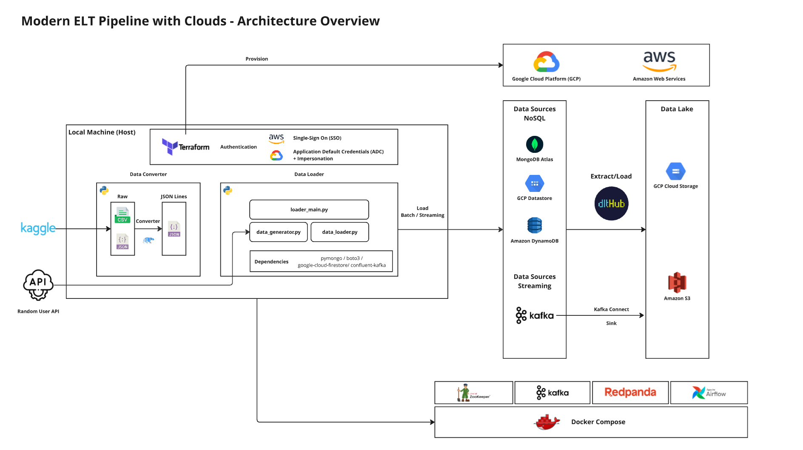
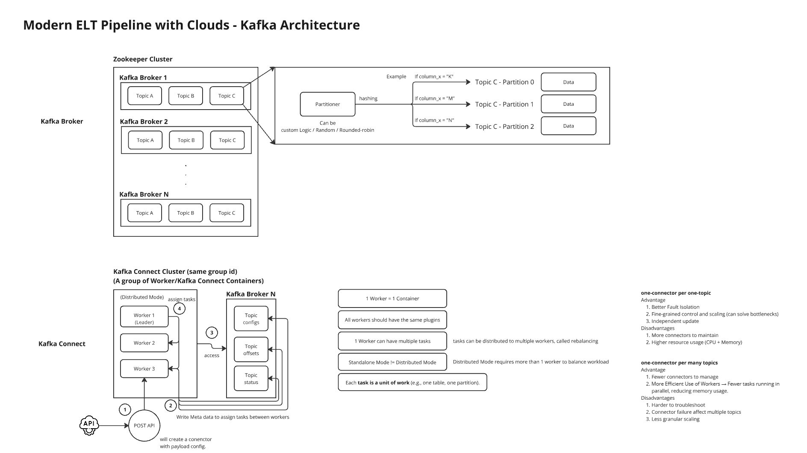

# Concept Guide

*Patcharanat P.*

## Overview

This project emphasized setting up environment for Data Engineering pipelines, including:
1. Initializing Airflow and Kafka on local environment with docker compose.
2. Enabling cloud resources in GCP and AWS for testing.
3. Implementing Data Loading Module for data initialization.

What expected from this project is technical detail on how to send data for batch and streaming type with different APIs.

## Table of Contents
1. [Preparing Airflow and Kafka on Local Environment with Docker Compose](#1-preparing-airflow-and-kafka-on-local-environment-with-docker-compose)
2. [Data Loading Module (NoSQL Databases and Streaming Topics)](#2-data-loading-module-nosql-databases-and-streaming-topics)
3. [Cloud and Authentication](#3-cloud-and-authentication)
4. [Detail on Batch Pipeline (dlthub)](#4-detail-on-batch-pipeline-dlthub)
5. [Detail on Streaming Pipeline (Kafka Connect)](#5-detail-on-streaming-pipeline-kafka-connect)

## 1. Preparing Airflow and Kafka on Local Environment with Docker Compose

Usually, when we develop data pipelines, we always need development environment for testing our code before deploying it on production environment. Docker compose plays a crucial role by simulating development environment with microservices alike approach. Docker compose can initialize a session of:
- Airflow: used as an orchestrator to schedule batch jobs and make data pipeline work sequentially.
- Kafka: used as streaming platform to enable data streaming process with message-queue architecture.

Anyway, each of them have a lot of detail and configuration to understand in order to achieve goal successfully by the following:
- For Airflow,
    - We have to know which executor type we should use. Should we use LocalExecutor, CeleryExecutor, KubernetesExecutor, or CeleryKubernetesExecutor? and it also a good practice to know how it are different from each other.
        - CeleryExecutor is useful when we want to allocate computing resource to airflow workers, and tasks are critical and requires low-latency. It also requires redis, scheduler, worker, (and flower) to work together.
        - KubernetesExecutor is useful when you have kubernetes cluster and don't want a job to be executed by spinning up a whole new node to finish a single task. for more info please refer to [Kubernetes Executor - Airflow Official](https://airflow.apache.org/docs/apache-airflow/1.10.14/executor/kubernetes.html) 
        - In local development, we should use LocalExecutor to avoid configuration overhead, involving managing workload distribution.
    - We first have to adjust docker compose configuration from airflow official template to match our needs by customizing some config and removing unnecessary services such as redis, flower, and airflow worker.
        - Scheduler will be the only service that execute jobs. Webserver acted as user web interface to monitor tasks execution. PostgresDB is responsible for Airflow backend.
        - If we want to import some pre-defined configuration such as variables and connections, we also need to configure `entrypoint.sh` to be executed when airflow container spin up and that also means we need to add some of these custom configuration in docker compose to achieve this.
        - If we need to pack some dependencies to use in tasks, we need to *"baked"* it in airflow image and use that our own custom airflow image `Dockerfile` to set something up additionally.
        - Setting some environment variables is also important when you have to involve setting authentication and connection for airflow containers with external services which may vary depending on what services you use.
    - Docker compose supported using `.env` file that located in the same level with the docker-compose script. we can store secret and credentials to this file and access it with `${VARIABLE_NAME}` to use in docker compose file.
        - `env_file` is a file containing variables that will be used as environment variables in the container when running.
- For Kafka,
    - Its setup is like the Airflow that requires a lot of components to work properly but different in architecture.
        - Kafka requires Zookeeper for a cluster to store broker(s) that may contain multiple topics that again may contain multiple partitions.
        - Unlike Airflow that solely relies on Kubertenes for fault-tolerance, Kafka extended it by utilizing brokers replication within the cluster or clusters replication concepts to ensure that streaming data send data successfully without downtime.
        - Kafka Broker is a core component that acted as pipeline, storing streaming data with scalable approach, and also depending on how producer and consumer is implemented.
        - A topic acted as a table but for streaming data, represented as json, avro, or parquet depending on usecases and requirements.
        - Partition enable Kafka to work paralelly by consumers. Setting this properly and not properly such as partitioner and number of partition would relate to performance issues.
        - Schema Registry is a tedious component that requires you to setup in order to send data with integrity by data contract. Optionally, the code would be more mature if we implement python pydantic model to ensure validation of all components.
        - Kafka Rest proxy allow you to communicate to kafka with RestAPI which allow us to manage Kafka components easier.
        - redpanda or conduktor is interface service to allow user monitor Kafka streaming via web UI console.
        - Kafka connect is simply pre-built producer-consumer that communities supported to easily connect Kafka with well-known sources and destinations. Kafka Connect is the first solution to look for before implementing consumer and producer yourself.
        - Kafka connect just requires us to configure connector configuration and *deploy* with a single RestAPI command to operate.
        - It's a good practice to version kafka connector configuration as code.
    - Setting Kafka environment is not an easy task for an individual. It require a lot of configuration and comprehension in architecture to setup fault-tolerance successfully.
    - To setup Kafka in local with docker compose I found the following issues that we should concern:
        - Exposing port for kafka services, particulary if we want to change conduktor console with redpanda.
        - Additionally configuring redpanda configuration.
        - Kafka connect requires authentication within a *worker* in order to retrieve and sink data from source and destination successfully.
        - Some officially supported connetor might still not support all usecases such as using AWS SSO authentication method with S3 connector.
        - In order to use official connector, we have to install connector from confluent in kafka-connect container that may result in using custom kafka connect image (baked image) or adding some command to execute before starting container in docker compose.

## 2. Data Loading Module (NoSQL Databases and Streaming Topics)

In this project data loader is implemented for loading data to different destination such as MongoDB, Firestore, DynamoDB for NoSQL and Kafka for streaming.

Although all the NoSQL databases may have different API syntax, they all are still using the same concept of storing semi-strucutre data in a database that may contain in different topic, called collection or table depending on what database is.
- MongoDB, to me is the most common NoSQL database to work with. It require to manage something on Mongo Atlas first time in Web UI such as authentication or network issue. After that we can manage database and collection via python api called `pymongo` which allow us to delete, reset, or insert *documents* in a collection.
- Firestore is NoSQL service for GCP but using the same concept with MongoDB havng collection and database. Leveraging official GCP python api: `google-cloud-firestore` allow us to manage Firestore through python code.
- DynamoDB is also NosQL service but for AWS. it use concept of separate table and not having a core database to store these tables. Like the others, using official provider's: `boto3`, we are able to interact with database through python api. 

All the NoSQL database have its own optimization technique that I did not dive into it, like indexing etc. For GCP and AWS I believe it a good practice to provision these resources through Terraform for tracking all the changes and keeping it versioned as a code, but it may require some overhead of managing authentication due to multiple cloud providers.

Some databases support bulk loading (loading multiple documents at the same time) instead of having only single document inserting approach.

For Kafka, data loader module acted as a producer with some custom code (partitioning and serializer) to send data to specified topic. So, we have to spin up kafka service with docker compose first, not like NoSQL that we have to provision resource with terraform or in manual way.

**Terminology**

- I found that Kafka is working based on TCP protocol, so we have to serialize it to bytes before sending it to topics, which could be JSON, Avro, etc. Serializer depending on how data is sent to producer to send to topics.
- A consumer or Kafka Connect also requires the same type of serializer to decode it to completed message. So, it required well-defined plan before implementing/executing everything, unless we have to go back and forth to fix this and that to make things work together eventually.

## 3. Cloud and Authentication

We have different authentication method due to different clouds.
- For **GCP**,
    - I used Application Default Credentials (ADC) which is the most secured way to authenticate with short-lived credentials for local environment.
    - It's required to authenticate interactively via Web UI in the first time and it will store short-lived credentials it our local machine. For more detail of how it work, please refer to another project's documentation here: [GCP ADC for Terraform - Ecommerce-Invoice-End-to-end - GitHub](https://github.com/patcha-ranat/Ecommerce-Invoice-End-to-end?tab=readme-ov-file#222-gcp-adc-for-terraform)
- For **AWS**,
    - I used Single-Sign On (SSO) method which is quite a new way to authenticate with AWS.
    - In traditionally, AWS allow us to create user, then add the user to a group and also add permission to the group to enable access for all user(s) that are added to the group. This is like GCP Impersonation approach to centralize access to a single service account.
    - Anyway, traditional way, called ***IAM***, requires long-lived credentials to be exist. We have to download credentials as CSV file and keep it somewhere safe (and also must not be pushed to public repository).
    - On the other hand, SSO (Identity Center) enable short-lived credentials method, by running a few bash commands via `aws cli`, setting some SSO configuration in Identity Center, logging in, then we're good to go, time-limited credentials is in our local machine.
    - Our short-lived credentials store somewhere in `~/.aws/...` which may related to profile, SSO, cache etc.
    - When we try to authenticate via code or AWS CLI, if we don't specify properly, it will automatically look for credentials in `~/.aws/` directory (this worked for me with Terraform, boto3, and AWS CLI).
    - Sometimes, we might have different accounts for vaious services and environments, we can set `AWS_PROFILE` environment variable to specify which access it should automatically use.
- For **Kafka Connect with AWS**,
    - Sadly official S3 connector currently does not supported SSO method, so we have to use IAM approach, downloading long-lived credentials, then saving it as secret and injecting in docker compose during runtime with `.env` to set `AWS_ACCESS_KEY_ID` and `AWS_SECRET_ACCESS_KEY` properly.

For cloud services provisioning, we just use Terraform to provision all necessary components such as GCS, S3, DynamoDB Tables, Firestore database. It has not much to elaborated on except for authentication, using `variables.tf` and `terraform.tfvars` to inject secret variables during Terraform runtime.

We can know how we should write Terraform script by exploring official Terraform documentation, each cloud service has its own configuration, we don't have to remember it all, just what service we want is enough.
We can know how we should write Terraform script by exploring official Terraform documentation, each cloud service has its own service and configuration. We don't have to remember it all, just what service we want is enough.

## 4. Detail on Batch Pipeline (dlthub)

*dlt* is a modern tool for ELT/ETL data pipeline. It can either extract from data sources and load to various target destinations as a json lines file, or as structured format with schema pre-defined. It has official supported pre-built connectors that make us easier to enable ELT/ETL process.

In my opinion, dlt is useful when we have multiple data sources and destinations that could exhaust us to implement and maintain every single of connectors ourselves, but it also don't have much workload of data to ingest/load. However, it require a steep learning curve due to its highly customizable. And because of this, it make the tool itself become complex and overhead to manage things around, like importing pre-built pipeline, supplying credentials, connections, and providing configuration.

Moreover, if we have our own usecase, we can adjust its advance features to match our needs such as setting output to be compressed or not, making the tasks paralellized executed, leveraging built-in transformation, etc.

Since the tool could cover a lot of usecases, some usecases that we might be interested might not well-documented in official documentation and provided with only a few examples. And sometimes, error throwing is not straightforward which make it harder to debug.

Specifically, supplying credentials for dlt provide many alternative to achieve, but I avoid the recommended way of using `.toml`, because I don't want to mess up my dags directory just to unnecessarily directly supply configuration to dlt pipeline, since we already have airflow connections and variables to do that for us. And because of this, we have to work around by using `dlt.config[""]` or `dlt.secrets[""]` in specific order in python code to make things work. We have to initialize a dlt pipline first then set configuration and secrets after, then *add run* in the last, unless it don't work at all.

To me dlt is still far from a mature tool due to its low maintainability and a steep learning curve for tool adoption, which may not worth for big organizations that also have *big data* on their hands. There's still more common tools, which eveyone knows the concept and be able use with ease, easier for onboarding, and also be able to handle larger volume of data compared with dlt capability.

## 5. Detail on Streaming Pipeline (Kafka Connect)

As previously mentioned in topic [(1)](#1-preparing-airflow-and-kafka-on-local-environment-with-docker-compose) Kafka connect should be the first option to look for when we implement streaming data pipeline, so we don't have to build everything from scratch. Anyway, this is some important things to note:
- Kafka Connect is a service that we can pack dependencies such as pre-built connector (pre-built producer or consumer) to use during runtime.
- Conenctors require us to create configuration file (in json format) that's templated by official provider, and deploy it to initialize its process.
- Connector must have the same serializer with producer that serialize the data.
- Connector also requires its service container to have sufficient permission in order to authenticate the connector with destination.

For Kafka, it still have many left to explore that I haven't demonstrate in this project yet such as modifying partitioner, setting number of partition, configuring for fault-tolerance, utilzing offset, and paralellization. It require a lot of effort to learn all of it and not suit for a individual large-scale project like this.

---